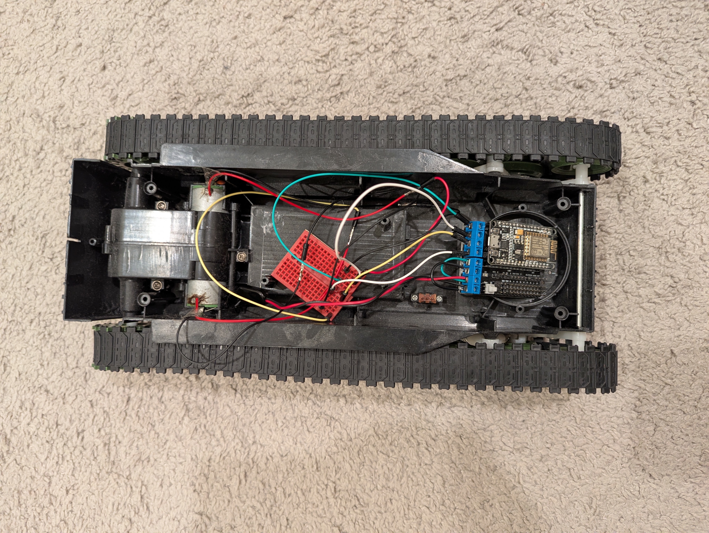
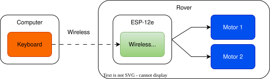

# ESP12e Rover
WiFi controlled rover with ESP-12e.

# How does it work
The ESP-12e rover is controlled by a keyboard (arrow keys) through a wireless access point (SSID: `rover-df473fcc`) created by ESP-12e.

## Message
A command message is sent to the rover from a computer using UDP, and the message contains the left anf right motor direction and speed commands. 

There are 4 characters in a message:
- Character 1: Left motor direction ('+': forward, '-': backward)
- Character 2: Left motor speed (0 - 127, encoded as an ASCII character. Ex. 97 -> 'a')
- Character 3: Right motor direction (Same as left motor)
- Character 4: Right motor speed (Same as left motor)

**Example**: `+a-2`

| Motor | Direction | Speed (0 - 127) |
|-------|-----------|-----------------|
| Left  | Forward   |       97        |
| Right | Backward  |       50        |

# What do you need

**Hardware**
- ESP-12e
- ESP-12e Motor Driver Board
- Battery (e.g. 9V battery)

**Software**
- Python3.12 with following packages
  - Keyboard control: `keyboard`
  - Joystick control: `pygame`
- Arduino IDE (For firmware development)
  - Additional board support: `arduino-esp8266`

# Run

1. Open the project with Arduino IDE.
    - Install esp9266 board support for Arduino IDE.
    - Configure IDE for ESP-12e. (Tool -> Board and Port)
2. Update WiFi SSID and password in [wifi_ap.ino](./firmware/wifi_ap.ino)
3. Upload sketch (`.ino`) to ESP-12e.
4. Power up ESP-12e
5. On the compute, connect to wireless access point defined in Step 2.
6. Run `sudo python3 scripts/udp_client.py`
    - For Nix, redefine environment variables: `sudo PYTHONPATH=$PYTHONPATH XDG_RUNTIME_DIR=$XDG_RUNTIME_DIR python3 scripts/udp_client.py`
